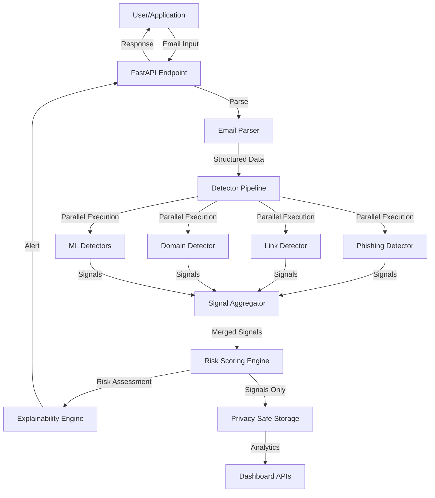
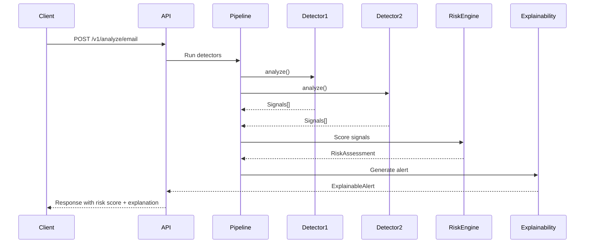

<div align="center">


# Aether-Guard

**Privacy-first, explainable AI cybersecurity system for threat detection**

[](https://www.python.org/)
[](https://fastapi.tiangolo.com/)
[](LICENSE)

</div>

---

## Overview

Aether-Guard is a modular cybersecurity platform designed to detect phishing emails, malicious links, suspicious domains, and social engineering threats. Built with a **privacy-first architecture**, the system analyzes threats without storing raw content, providing explainable security alerts suitable for educational institutions and enterprise environments.

### Key Principles

- 🔒 **Privacy-First**: Raw email content is never stored or logged
- 🧠 **Explainable AI**: Human-readable explanations for every security decision
- 🔌 **Modular Design**: Pluggable detector architecture for easy extension
- ⚡ **Parallel Processing**: Multiple detectors run concurrently for fast analysis
- 🎯 **Signal-Based**: Structured threat indicators feed into unified risk scoring

## Problem Statement

Traditional cybersecurity tools are often:
- **Black boxes** that don't explain why threats were detected
- **Privacy-invasive** by storing sensitive user content
- **Monolithic** and difficult to extend with new detection capabilities
- **Complex** for non-security experts to understand

Aether-Guard solves these issues by providing a **transparent, modular, and privacy-preserving** threat detection system that explains its decisions in plain language.

## Features

### Core Capabilities

- **Email Threat Analysis**: Detect phishing patterns, credential harvesting, and social engineering
- **Link Risk Assessment**: Analyze URLs for suspicious characteristics and reputation
- **Domain Reputation**: Identify typosquatting, suspicious TLDs, and domain spoofing
- **Hybrid Detection**: Combines rule-based heuristics with ML models
- **Real-time Analysis**: Fast parallel processing with sub-second response times

### System Features

- **Detector Registry**: Automatic discovery and registration of detection modules
- **Risk Scoring Engine**: Configurable weighted scoring with contribution breakdown
- **Explainability Layer**: Signal-to-explanation mapping for user-friendly alerts
- **Telemetry System**: Performance monitoring and detector reliability tracking
- **Dashboard APIs**: Privacy-safe analytics and threat statistics

## System Architecture



## Detection Pipeline

The detection system operates on a **signal-based architecture** where detectors emit structured indicators rather than raw decisions:



### Signal Structure

Each detector emits `Signal` objects:

```python
@dataclass
class Signal:
    name: str              # Stable identifier (e.g., "credential_request")
    confidence: float      # Normalized [0.0, 1.0]
    source: str            # Detector name
    evidence: str | None   # Optional explanation
```

### Detector Registry

Detectors automatically register themselves via decorator:

```python
@register_detector
class MyDetector(Detector):
    name = "my_detector_v1"
    
    def analyze(self, *, text: str, sender: str | None, links: list[str]) -> list[Signal]:
        # Detection logic
        return [Signal(name="threat_indicator", confidence=0.85, source=self.name)]
```

## Current Detectors

The system includes **9 detectors** (7 heuristic + 2 ML):

### Heuristic Detectors

| Detector | Purpose | Signals Emitted |
|----------|---------|----------------|
| `PhishingHeuristicDetector` | Pattern-based phishing detection | `urgent_language`, `credential_request`, `impersonation_language` |
| `LinkReputationDetector` | URL structure analysis | `link_reputation_risk`, `has_links` |
| `DomainSpoofingDetector` | Sender-link domain mismatch | `sender_link_domain_mismatch` |
| `UrgentLanguageDetector` | Time-pressure language detection | `urgent_language` |
| `CredentialRequestDetector` | Credential harvesting patterns | `credential_request` |
| `SuspiciousDomainDetector` | Domain typosquatting & TLD analysis | `suspicious_domain` |
| `UrlShortenerDetector` | URL shortener detection | `url_shortener` |

### ML Detectors

| Detector | Model Type | Signals Emitted |
|----------|-----------|----------------|
| `TransformerPhishingDetector` | HuggingFace Transformer | `ml_phishing_probability`, `ml_suspicious_intent` |
| `UrlMLRiskDetector` | Neural Network | `ml_url_risk_score` |

## Risk Scoring Engine

The risk engine combines signals from all detectors into a unified risk score:

### Scoring Process

1. **Signal Merging**: Multiple detectors emitting the same signal are merged (max confidence)
2. **Category Separation**: Signals split into heuristic and ML categories
3. **Weighted Scoring**: Each signal contributes based on configured weights
4. **Hybrid Combination**: Heuristic and ML scores combined with configurable weights
5. **Severity Classification**: Score mapped to LOW/MEDIUM/HIGH severity

### Configuration

```python
# config.py
hybrid_heuristic_weight: float = 0.6
hybrid_ml_weight: float = 0.4

risk_weights: dict[str, float] = {
    "credential_request": 0.28,
    "ml_phishing_probability": 0.25,
    "suspicious_domain": 0.18,
    # ... more weights
}
```

### Output Structure

```python
@dataclass
class RiskAssessment:
    risk_score: int              # 0-100
    severity: str                # "LOW" | "MEDIUM" | "HIGH"
    signals: dict[str, float]   # Merged signal confidences
    contributions: dict[str, float]  # Signal contributions to score
    heuristic_score: float | None   # Heuristic category score
    ml_score: float | None          # ML category score
```

## Explainability System

The explainability layer converts technical signals into user-friendly explanations:

### Signal-to-Explanation Mapping

```python
_SIGNAL_EXPLANATIONS = {
    "credential_request": (
        0.5, 
        "The message appears to ask for login credentials or account verification."
    ),
    "urgent_language": (
        0.5,
        "It uses urgent or time-pressure language to push quick action."
    ),
    # ... more mappings
}
```

### Alert Structure

```python
class ExplainableAlert:
    severity: Severity           # "low" | "medium" | "high"
    risk_score: int             # 0-100
    title: str                  # Alert title
    explanation: str            # Plain-language explanation
    what_we_saw: list[str]      # Specific indicators detected
    recommended_action: str     # What the user should do
    teach_back: str             # Educational security tip
```

## API Usage

### Primary Endpoint

**POST** `/v1/analyze/email`

Analyze an email for security threats.

#### Request

```json
{
  "email_text": "URGENT: Your account will be locked. Verify your password here: https://example.com/login",
  "sender": "it-support@gmail.com",
  "links": ["https://example.com/login"]
}
```

#### Response

```json
{
  "risk_score": 72,
  "severity": "high",
  "alert": {
    "severity": "high",
    "risk_score": 72,
    "title": "Potential Phishing Attempt",
    "explanation": "High risk: this message resembles common phishing patterns.",
    "what_we_saw": [
      "The message appears to ask for login credentials or account verification.",
      "It uses urgent or time-pressure language to push quick action.",
      "The sender domain and link domain(s) do not appear to match."
    ],
    "recommended_action": "Do not click links or open attachments. Verify via the official campus portal.",
    "teach_back": "Phishing often creates urgency and asks you to log in. Always navigate to sites by typing the official address yourself."
  },
  "signals": {
    "credential_request": 0.85,
    "urgent_language": 0.72,
    "sender_link_domain_mismatch": 0.70,
    "suspicious_domain": 0.45
  },
  "signal_details": [
    {
      "name": "credential_request",
      "confidence": 0.85,
      "source": "credential_request_detector_v1",
      "evidence": "Detected 2 pattern(s) suggesting a request for credentials."
    }
  ],
  "contributions": {
    "credential_request": 0.238,
    "urgent_language": 0.086,
    "sender_link_domain_mismatch": 0.098
  }
}
```

### Other Endpoints

- **GET** `/v1/health` - Health check
- **GET** `/v1/alerts` - Privacy-safe alert history
- **GET** `/v1/stats` - Risk statistics
- **GET** `/v1/detectors` - Detector telemetry and performance metrics

### Interactive Documentation

Once running, visit:
- **Swagger UI**: `http://localhost:8000/docs`
- **ReDoc**: `http://localhost:8000/redoc`

## Repository Structure

```
aether-guard/
├── backend/                          # FastAPI backend service
│   ├── aether_guard/
│   │   ├── api/                      # API routes
│   │   │   ├── routes/
│   │   │   │   ├── analyze.py       # Email analysis endpoint
│   │   │   │   ├── dashboard.py     # Dashboard APIs
│   │   │   │   └── health.py        # Health check
│   │   ├── detection/                # Detector modules
│   │   │   ├── base.py              # Detector interface
│   │   │   ├── ml_base.py           # ML detector base class
│   │   │   ├── pipeline.py          # Parallel execution pipeline
│   │   │   ├── registry.py          # Detector registry
│   │   │   ├── signals.py            # Signal data structure
│   │   │   └── [detectors]/         # Individual detector implementations
│   │   ├── explainability/          # Explainability engine
│   │   │   └── alerts.py            # Signal-to-explanation mapping
│   │   ├── intelligence/            # Threat intelligence
│   │   │   └── domain_reputation.py # Domain reputation analysis
│   │   ├── services/                # Core services
│   │   │   ├── risk_engine.py       # Risk scoring
│   │   │   ├── telemetry.py        # Performance tracking
│   │   │   └── alert_store.py      # Privacy-safe storage
│   │   └── utils/                  # Utilities
│   │       └── email_parser.py      # Email parsing
│   ├── tests/                       # Test suite
│   ├── requirements.txt             # Python dependencies
│   └── pytest.ini                   # Pytest configuration
├── ai_models/                       # ML model placeholders
│   ├── phishing_transformer/       # Transformer model
│   ├── url_classifier/              # URL risk classifier
│   └── [other models]/             # Future ML models
├── infrastructure/                  # Deployment configs
│   └── docker/
│       ├── backend.Dockerfile      # Backend container
│       └── docker-compose.yml      # Docker Compose setup
└── frontend/                        # Frontend (future)
```

## Technology Stack

### Core

- **Python 3.11+** - Runtime
- **FastAPI** - Web framework
- **Pydantic** - Data validation
- **Uvicorn** - ASGI server

### ML/AI (Optional)

- **PyTorch** - ML framework
- **HuggingFace Transformers** - Pre-trained models
- **ROCm** - AMD GPU acceleration support

### Testing

- **pytest** - Testing framework
- **pytest-asyncio** - Async test support

## Quick Start

### Prerequisites

- Python 3.11 or 3.12 (recommended)
- Docker (optional, for containerized deployment)

### Local Development

1. **Clone the repository**

```bash
git clone https://github.com/your-org/aether-guard.git
cd aether-guard
```

2. **Set up backend**

```bash
cd backend
python -m venv .venv
source .venv/bin/activate  # On Windows: .venv\Scripts\activate
pip install -r requirements.txt
```

3. **Run the server**

```bash
uvicorn aether_guard.main:app --host 0.0.0.0 --port 8000 --reload
```

4. **Verify installation**

```bash
curl http://localhost:8000/v1/health
```

Visit `http://localhost:8000/docs` for interactive API documentation.

### Docker Deployment

```bash
docker compose -f infrastructure/docker/docker-compose.yml up --build
```

The API will be available at `http://localhost:8000`.

## Running Tests

```bash
cd backend
pytest
```

Run specific test categories:

```bash
pytest -m "not slow"           # Skip slow tests
pytest tests/test_detectors.py # Run detector tests only
```

## Privacy Architecture

Aether-Guard is designed with privacy as a core principle:

### Privacy Guarantees

- ✅ **No Raw Storage**: Email content is never persisted
- ✅ **Signal-Only Storage**: Only derived threat indicators are stored
- ✅ **No Logging**: Raw content is not logged (configurable)
- ✅ **Explainable**: Decisions explained via signals, not raw text

### Data Flow

```
Raw Email → Parsing → Detectors → Signals → Risk Engine → Alert
                ↓
         (Discarded)
```

Only the **signals** and **risk assessment** are stored for analytics.

## Configuration

Configuration is managed via environment variables (prefixed with `AETHER_GUARD_`) or `.env` file:

```bash
# Risk thresholds
AETHER_GUARD_RISK_LOW_MAX=29
AETHER_GUARD_RISK_MEDIUM_MAX=69

# Hybrid scoring weights
AETHER_GUARD_HYBRID_HEURISTIC_WEIGHT=0.6
AETHER_GUARD_HYBRID_ML_WEIGHT=0.4

# Privacy settings
AETHER_GUARD_STORE_SIGNAL_HISTORY=true
AETHER_GUARD_MAX_ALERT_HISTORY=500
```

See `backend/aether_guard/config.py` for all available settings.

## Extending the System

### Adding a New Detector

1. **Create detector class**

```python
# backend/aether_guard/detection/my_detector.py
from aether_guard.detection.base import Detector
from aether_guard.detection.registry import register_detector
from aether_guard.detection.signals import Signal

@register_detector
class MyDetector(Detector):
    name = "my_detector_v1"
    
    def analyze(self, *, text: str, sender: str | None, links: list[str]) -> list[Signal]:
        # Your detection logic
        confidence = 0.75
        return [
            Signal(
                name="my_threat_indicator",
                confidence=confidence,
                source=self.name,
                evidence="Detected threat pattern X"
            )
        ]
```

2. **Import in detection module**

The detector will auto-register when imported. Add to `backend/aether_guard/detection/__init__.py`:

```python
from aether_guard.detection import my_detector
```

3. **Configure weights**

Add signal weights in `config.py`:

```python
risk_weights: dict[str, float] = {
    "my_threat_indicator": 0.15,
    # ... existing weights
}
```

4. **Add explanation mapping**

Update `backend/aether_guard/explainability/alerts.py`:

```python
_SIGNAL_EXPLANATIONS = {
    "my_threat_indicator": (
        0.5,
        "Explanation of what this indicator means."
    ),
    # ... existing mappings
}
```

### Adding ML Models

ML detectors extend `MLDetector` base class:

```python
from aether_guard.detection.ml_base import MLDetector

@register_detector
class MyMLDetector(MLDetector):
    name = "my_ml_detector_v1"
    
    def _load_model(self):
        # Load PyTorch model
        return model
    
    def _preprocess(self, *, text, sender, links):
        # Prepare inputs
        return inputs
    
    def _infer(self, inputs):
        # Run inference
        return outputs
    
    def _postprocess(self, outputs, *, text, sender, links):
        # Convert to Signals
        return signals
```

## Performance

### Benchmarks

- **Average Response Time**: < 200ms (heuristic detectors)
- **ML Inference**: < 500ms (with GPU acceleration)
- **Parallel Execution**: All detectors run concurrently
- **Throughput**: 100+ requests/second (depends on hardware)

### Telemetry

Monitor detector performance:

```bash
curl http://localhost:8000/v1/detectors
```

Returns execution times, reliability scores, and signal frequency.

## Roadmap

### Planned Features

- [ ] **Document Analysis**: OCR + tamper detection for PDFs and Office documents
- [ ] **Login Anomaly Detection**: Behavioral analysis for suspicious login patterns
- [ ] **Threat Intelligence Integration**: WHOIS lookups, domain age, reputation APIs
- [ ] **Batch Processing**: Analyze multiple emails in parallel
- [ ] **Model Fine-tuning**: Tools for training custom phishing classifiers
- [ ] **Frontend Dashboard**: React/Next.js UI for threat visualization

### Under Consideration

- [ ] **GraphQL API**: Alternative to REST for complex queries
- [ ] **WebSocket Support**: Real-time threat streaming
- [ ] **Multi-language Support**: Detection for non-English emails
- [ ] **Custom Detector Marketplace**: Share detectors across deployments

## Contributing

Contributions are welcome! Please follow these guidelines:

1. **Fork the repository**
2. **Create a feature branch** (`git checkout -b feature/amazing-feature`)
3. **Write tests** for new functionality
4. **Ensure tests pass** (`pytest`)
5. **Follow code style** (PEP 8, type hints)
6. **Update documentation** as needed
7. **Submit a pull request**

### Development Setup

```bash
# Install development dependencies
pip install -r requirements.txt
pip install pytest pytest-asyncio

# Run tests
pytest

# Check code style (if using tools)
# flake8 backend/
# mypy backend/
```

## License

This project is licensed under the MIT License - see the [LICENSE](LICENSE) file for details.

## Acknowledgments

- Built with [FastAPI](https://fastapi.tiangolo.com/)
- ML models use [HuggingFace Transformers](https://huggingface.co/)
- Designed for educational institutions and privacy-conscious organizations

## Support

- **Documentation**: See `/docs` endpoint when running
- **Issues**: [GitHub Issues](https://github.com/your-org/aether-guard/issues)
- **Discussions**: [GitHub Discussions](https://github.com/your-org/aether-guard/discussions)

---

<div align="center">

**Aether-Guard** - Privacy-first, explainable cybersecurity

[Documentation](docs/) • [API Reference](http://localhost:8000/docs) • [Contributing](CONTRIBUTING.md)

</div>
